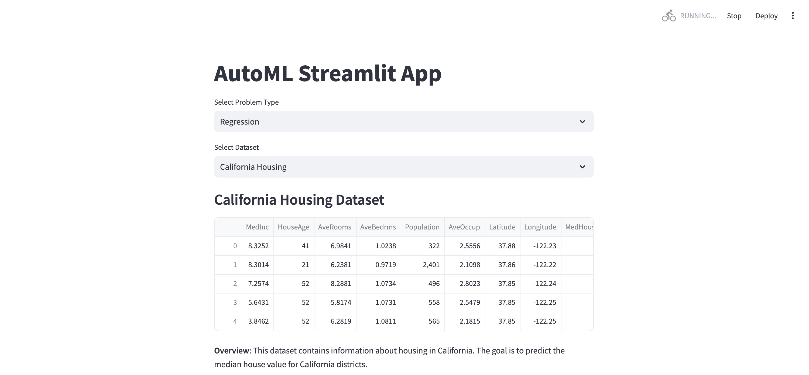
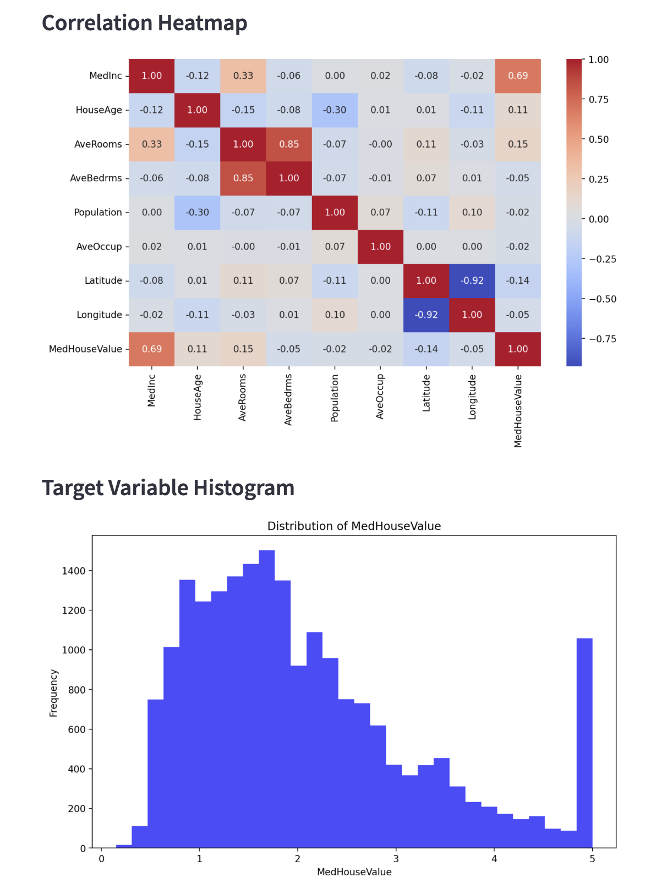

# AutoML Visualization with Streamlit

This project demonstrates the power of AutoML (Automated Machine Learning) using TPOT and Streamlit.

## Overview

This Streamlit application allows users to:
- Select different datasets (e.g., California Housing, Diabetes)
- Choose between regression and classification problems
- Automatically find the best machine learning pipeline for the selected task
- Visualize data and model results
- Explore model explanations using various XAI (Explainable AI) techniques

## Features

- **Select Problem Type**: Choose between regression and classification problems.
- **Dataset Selection**: Select from the following datasets:
  - **Regression**:
    - Boston Housing
    - Diabetes
  - **Classification**:
    - Iris
    - Breast Cancer
- **Data Visualization**:
  - Visualize the correlation heatmap and the distribution of the target variable using histograms.
- **AutoML Integration**: Automatically train the best machine learning model using TPOT and display the results.

## Installation

To run this project, you need to install the required packages. You can do this by running:

## Usage

Run the Streamlit app:

## License

MIT License

Copyright (c) 2024 Dongin Kim

Permission is hereby granted, free of charge, to any person obtaining a copy
of this software and associated documentation files (the "Software"), to deal
in the Software without restriction, including without limitation the rights
to use, copy, modify, merge, publish, distribute, sublicense, and/or sell
copies of the Software, and to permit persons to whom the Software is
furnished to do so, subject to the following conditions:

The above copyright notice and this permission notice shall be included in all
copies or substantial portions of the Software.

THE SOFTWARE IS PROVIDED "AS IS", WITHOUT WARRANTY OF ANY KIND, EXPRESS OR
IMPLIED, INCLUDING BUT NOT LIMITED TO THE WARRANTIES OF MERCHANTABILITY,
FITNESS FOR A PARTICULAR PURPOSE AND NONINFRINGEMENT. IN NO EVENT SHALL THE
AUTHORS OR COPYRIGHT HOLDERS BE LIABLE FOR ANY CLAIM, DAMAGES OR OTHER
LIABILITY, WHETHER IN AN ACTION OF CONTRACT, TORT OR OTHERWISE, ARISING FROM,
OUT OF OR IN CONNECTION WITH THE SOFTWARE OR THE USE OR OTHER DEALINGS IN THE
SOFTWARE.